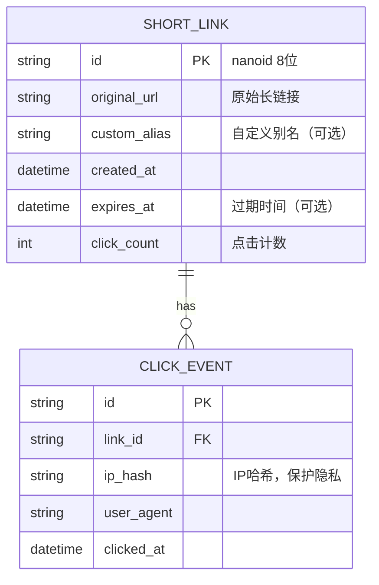
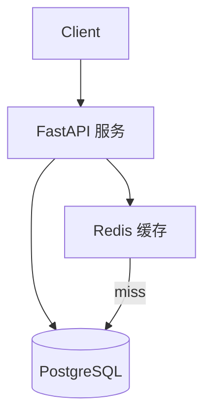

# RFC.md — 需求规格文档

> **说明**：本文件是项目需求的唯一来源（Single Source of Truth）。  
> 所有需求变更必须通过 `propose.py` 流程进行，变更历史记录在 `RFC_CHANGELOG.md`。  
> 需求编号 REQ-NNN 一旦分配，永不复用（废弃的需求改为 `deprecated` 状态）。
>
> **状态说明**：
> - `draft` — 待评审
> - `approved` — 已批准，待实施
> - `implemented` — 已实施
> - `deprecated` — 已废弃

---

## 项目概述

```
项目名称：TinyLink
目标用户：开发者、内容创作者、营销人员
核心价值：将长 URL 压缩为短码，支持点击统计和自定义别名，方便分享与追踪
版本：v1.1.0
最后更新：2026-01-20
```

---

## 明确不做的事（Out of Scope）

> **以下内容在本版本中明确不实现，防止范围蔓延。**

- ❌ 不支持用户系统（注册/登录）—— 匿名使用，v2 再议
- ❌ 不支持付费功能（流量统计套餐、付费别名）—— 商业化版本另立项目
- ❌ 不支持二维码生成 —— 可作为 v2 插件功能
- ❌ 不支持批量导入 URL —— 单次 API 调用，批量另立接口

---

## F1: 核心链接管理

> **功能域说明**：负责短链接的创建、存储和查询，是系统的核心数据层。

### REQ-001: 生成短链接

- **描述**：用户通过 POST /api/shorten 提交长 URL，系统生成随机 8 位短码，支持用户指定自定义别名
- **验收标准**：
  - 提交合法 URL，返回 HTTP 201，body 包含 `short_code` 和完整短链接地址
  - 生成的短码由 `[a-zA-Z0-9]` 组成，长度为 8 位
  - 用户可选传入 `custom_alias` 字段（1-32 位，`[a-zA-Z0-9_-]`）
  - 提交非法 URL 格式，返回 HTTP 422
- **优先级**：P0
- **状态**：implemented
- **关联**：REQ-007

### REQ-002: 查询短链接详情

- **描述**：通过短码查询短链接的原始 URL、创建时间、点击次数等元数据
- **验收标准**：
  - GET /api/links/{code} 返回 HTTP 200 及完整元数据
  - 短码不存在返回 HTTP 404
  - 已过期的短链接返回 HTTP 410
- **优先级**：P1
- **状态**：implemented
- **关联**：REQ-001

### REQ-003: 设置链接过期时间

- **描述**：创建短链接时可选设置过期时间，过期后重定向返回 410
- **验收标准**：
  - 创建时可传 `expires_at`（ISO 8601 格式）
  - 过期后访问短链接，返回 HTTP 410 Gone
  - 不传 `expires_at` 则永不过期
- **优先级**：P1
- **状态**：implemented
- **关联**：REQ-001, REQ-004

---

## F2: 重定向

> **功能域说明**：负责将短码解析为原始 URL 并执行 302 重定向，同时异步记录点击事件。

### REQ-004: 短码重定向

- **描述**：用户访问 GET /{code}，系统查询短码对应的原始 URL 并 302 重定向
- **验收标准**：
  - 有效短码返回 HTTP 302，Location 头指向原始 URL
  - 无效短码返回 HTTP 404
  - 已过期短码返回 HTTP 410
  - 重定向 P99 延迟 < 50ms（含 Redis 缓存命中）
- **优先级**：P0
- **状态**：implemented
- **关联**：REQ-001, REQ-003, REQ-005

### REQ-005: 点击事件记录

- **描述**：每次重定向时异步记录点击事件，包含 IP 哈希、User-Agent、时间戳
- **验收标准**：
  - 点击事件写入不阻塞重定向响应（异步写入）
  - IP 字段存储哈希值（SHA-256），不存明文 IP
  - User-Agent 字段截断至 512 字符
- **优先级**：P0
- **状态**：implemented
- **关联**：REQ-004, REQ-006

---

## F3: 统计

> **功能域说明**：提供短链接点击数据的聚合查询接口。

### REQ-006: 查询点击统计

- **描述**：GET /api/links/{code}/stats 返回指定短链接的点击统计数据
- **验收标准**：
  - 返回总点击数、最近 7 天每日点击数
  - 短码不存在返回 HTTP 404
  - 支持按日期范围过滤（`from`、`to` 查询参数，ISO 8601）
- **优先级**：P1
- **状态**：implemented
- **关联**：REQ-005

### REQ-007: 自定义别名唯一性校验

- **描述**：创建短链接时若指定 `custom_alias`，系统校验别名唯一性，冲突返回 409
- **验收标准**：
  - 别名已存在时返回 HTTP 409，body 包含 `detail: "alias already taken"`
  - 别名格式不合法（含特殊字符、超长）返回 HTTP 422
  - 别名与随机短码共用同一命名空间，不允许冲突
- **优先级**：P1
- **状态**：implemented
- **关联**：REQ-001

---

## 非功能需求

### NFR-001: 性能

- 重定向接口（GET /{code}）P99 延迟 < 50ms
- 系统支持 1000 QPS，无性能降级
- 数据库查询单次不超过 10ms（热点短码走 Redis 缓存）

### NFR-002: 安全

- IP 地址不得存明文，使用 SHA-256 哈希存储（保护用户隐私）
- API 全面启用 HTTPS
- 输入 URL 做基础校验，防止 SSRF（禁止访问内网 IP 段）

### NFR-003: 可维护性

- 测试覆盖率不低于 80%（核心重定向逻辑不低于 90%）
- 新功能上线前必须通过 `arch-check.py` 和 `lock-check.py`

### NFR-004: 可用性

- 服务 SLA 目标：99.9%
- Redis 缓存失效时降级到数据库直查，不影响可用性

---

## 数据模型



---

## 系统架构


